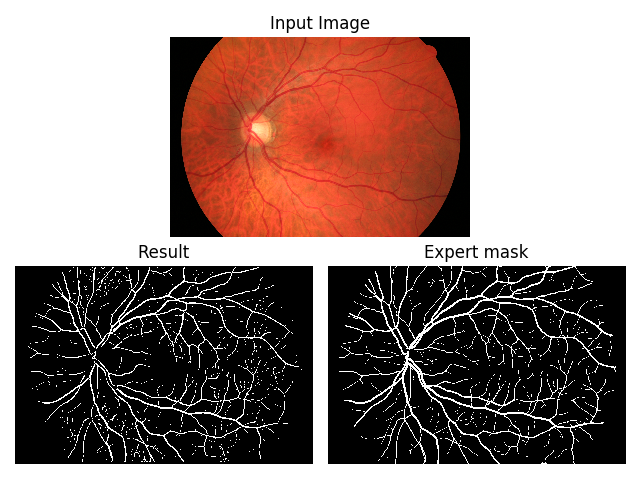

# RetinalBloodVessels :drop_of_blood:

#### What is it?
Python script detecting retinal blood vessels in input image and creating
binary mask using image processing and/or machine learning
RandomForestClassifier model.

